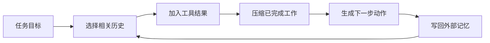

> 本文是对 Anthropic 工程文章的中文导读与实践整理，不是原文翻译。

过去我们常把注意力放在 prompt 上：如何写一句更准确的指令，如何给出更好的示例。但当 Agent 开始执行几十轮工具调用、跨文件修改或长时间研究时，问题已经不只是“提示词怎么写”，而是“下一次模型调用应该看到什么”。

## 把上下文看成有限预算

上下文窗口很大，不等于所有信息都值得放进去。历史对话、工具返回、搜索结果、系统规则和临时计划会不断争夺模型的注意力。信息越多，关键线索反而越容易被淹没。

一个实用原则是：保留能够改变下一步决策的信息。已经完成的操作可以压缩成结论，冗长的工具输出可以只留下关键字段，重复出现的背景无需每轮完整传递。

## 长任务的三种做法

第一种是**压缩**。当对话接近窗口上限时，把目标、关键决策、已完成工作和未解决问题整理成高保真摘要，再开启新的上下文。

第二种是**结构化笔记**。让 Agent 把计划、约束和进度写入外部文件，需要时再读取。它比依赖完整聊天历史更稳定，也更容易人工检查。

第三种是**子 Agent 分工**。把检索、代码分析或数据核对交给拥有干净上下文的子任务，主 Agent 只接收浓缩后的发现，避免把所有探索过程堆进一个窗口。

## 我的工程检查清单

1. 工具输出是否只返回完成任务所需的信息？
2. 当前上下文里是否存在已经失效的计划或重复材料？
3. 压缩摘要是否保留了约束、失败尝试和未完成事项？
4. 是否可以把独立探索交给子任务，只回收结论？

上下文工程的目标不是把信息塞满，而是让每个 token 都更接近当前决策。对长时间运行的 Agent 来说，这往往比继续增加提示词更有效。

原文：[Effective context engineering for AI agents](https://www.anthropic.com/engineering/effective-context-engineering-for-ai-agents)，Anthropic Applied AI Team，2025-09-29。
