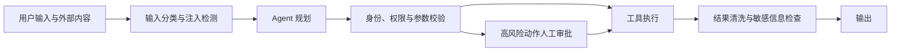

> 本文整理自 OpenAI《A practical guide to building agents》中的 guardrails 方法。

Agent 的风险不只来自不当文本。它还可能选择错误工具、访问越权数据、重复执行写操作，或把外部页面里的恶意指令当成系统要求。单一内容过滤器无法覆盖整个执行链。

## 按风险给动作分级

只读搜索和修改付款信息不应采用同一策略。可以按可逆性、影响范围、数据敏感度和外部副作用分级：低风险自动执行，中风险加强校验，高风险要求人工确认或禁止自动化。

工具层必须再次检查权限，不能相信模型已经正确判断。用户身份、资源所有权、金额上限和允许操作都应由确定性代码验证。

## 外部内容不是可信指令

网页、邮件和文档可能包含 prompt injection。系统应区分“用于回答的数据”与“有权改变行为的指令”，避免把工具结果原样拼进高优先级提示。敏感数据也应在进入模型前最小化。

## 护栏同样需要评测

建立安全评测集，包含越权请求、诱导泄露、重复提交、恶意工具结果和边界案例。记录误拦截与漏拦截，避免护栏严格到系统无法工作，或宽松到只剩一层形式检查。

安全 Agent 不是“模型更听话”，而是即使模型判断错误，系统仍有权限边界、审计轨迹和可停止机制。

原文：[A practical guide to building agents](https://openai.com/business/guides-and-resources/a-practical-guide-to-building-ai-agents/)，OpenAI，2025-01-21。
