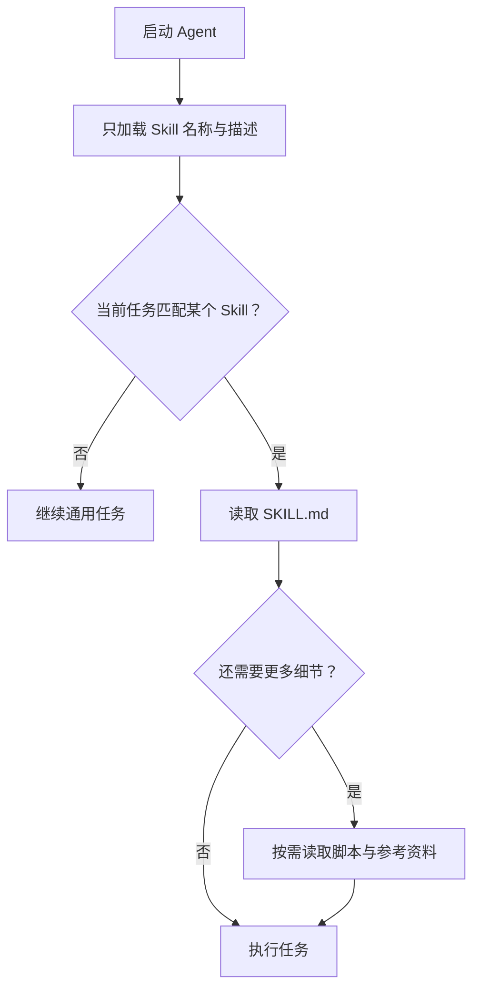

> 本文整理自 Anthropic Agent Skills 的设计介绍。

模型知道通用知识，但真实工作还依赖组织流程、文件模板、内部术语和确定性脚本。若把所有规则永久放进系统提示，会快速挤占上下文，也难以复用和版本化。

## 三层渐进披露

第一层只加载名称和简短描述，让 Agent 知道能力存在。第二层在任务匹配时读取完整说明。第三层才是按需打开脚本、模板和参考文件。

这种结构把上下文成本推迟到真正需要的时候，也让一个通用 Agent 可以安装很多能力，而不必在每次调用中携带全部内容。

## Skill 应该包含什么

一个 Skill 的核心不是大段背景知识，而是可执行流程：何时使用、输入输出、步骤顺序、失败处理和验收标准。重复且确定的操作适合写成脚本，复杂例子和格式规范可以放在单独参考文件中。

描述字段尤其重要，它决定 Agent 是否会发现并加载 Skill。描述应同时说明任务触发条件和能力边界，避免与其他 Skill 大量重叠。

## 把它当成软件包维护

Skills 需要版本控制、测试任务和兼容性检查。团队流程变化时，更新一个能力包比散落修改多个 Agent 提示更可靠。它也是组织知识从“某个人会做”走向“系统可以重复执行”的一种轻量方式。

原文：[Equipping agents for the real world with Agent Skills](https://www.anthropic.com/engineering/equipping-agents-for-the-real-world-with-agent-skills)，Anthropic，2025-10-16。
