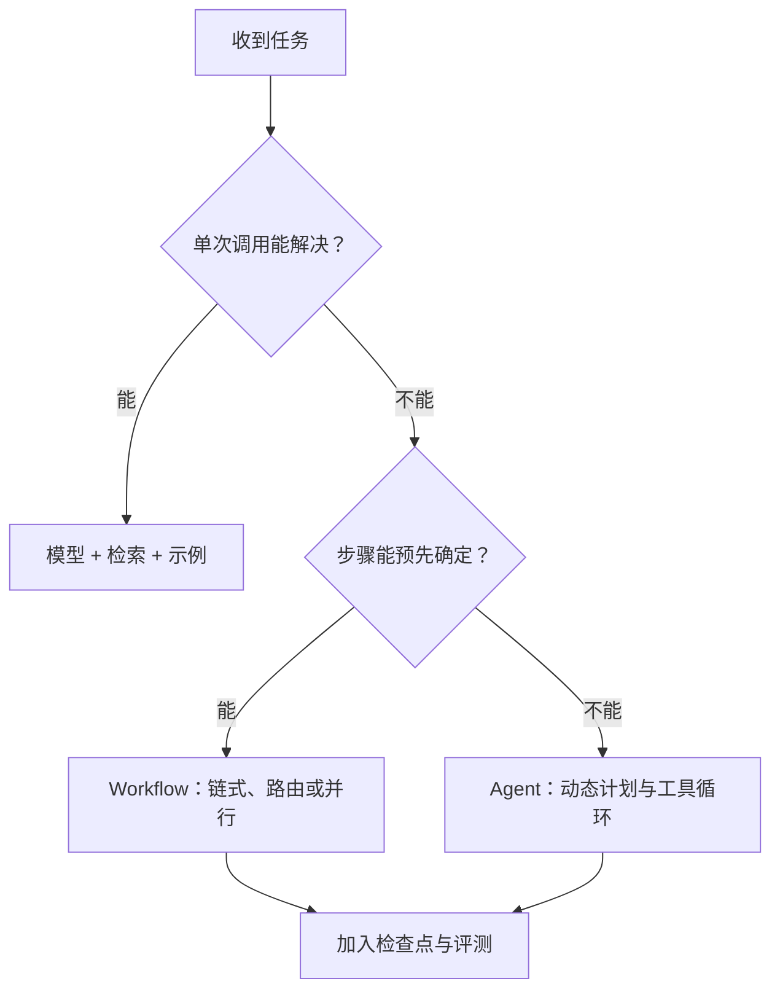

> 本文是对 Anthropic《Building effective agents》的中文学习笔记。

Agent 项目很容易从框架和概念开始，最后却难以解释一次失败究竟发生在哪里。Anthropic 总结的经验很朴素：成功系统通常不是最复杂的系统，而是由简单、透明、可组合的模式逐步搭建出来的。

## Workflow 和 Agent 是两类系统

Workflow 由代码规定执行路径，适合步骤清楚、边界稳定的任务。Agent 则让模型动态决定下一步以及使用什么工具，适合无法提前写死流程的开放问题。

选择时要问三个问题：

1. 任务能否被稳定拆成固定步骤？
2. 模型是否必须根据中间结果动态改变计划？
3. 更高的成本、延迟和错误累积风险是否值得？

如果一次模型调用加检索和示例已经能解决问题，就没有必要急着引入自治循环。

## 常见的可组合模式

**Prompt chaining** 把复杂任务拆成连续的小步骤，并在中间加入检查。**Routing** 先识别请求类型，再交给专门流程。**Parallelization** 同时执行独立子任务，或通过多次尝试提高置信度。

当子任务无法预先确定时，可以使用 **orchestrator-workers**：由一个模型规划并分派工作。对于有明确质量标准的内容，还可以使用 **evaluator-optimizer**，让生成器和评估器循环改进结果。

## 工具接口比框架名称更重要

模型需要清楚地知道工具做什么、参数代表什么、失败时会返回什么。好的工具应该职责单一、命名明确，并尽量让错误操作难以发生。

生产系统还需要可观察性：展示 Agent 的计划、记录每次工具调用、设置停止条件，并让模型持续从真实环境结果中校正动作。自治不是放弃控制，而是把控制放在清晰的接口、验证和边界里。

原文：[Building effective agents](https://www.anthropic.com/engineering/building-effective-agents)，Erik Schluntz、Barry Zhang，2024-12-19。
