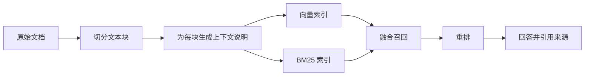

> 本文根据 Anthropic 的 Contextual Retrieval 方案整理，并补充工程实践建议。

RAG 的典型流程是切分文档、生成向量、检索相关文本块，再把结果交给模型。问题在于，切块虽然方便检索，也可能把主语、时间、章节和业务背景一起切掉。

例如一个文本块只写着“本季度收入增长了 3%”。人能从原文上下文知道公司和季度，但独立的向量块不一定保留这些信息。查询中出现公司名时，这段内容就可能无法被召回。

## 在索引前补充块级说明

Contextual Retrieval 的核心是在每个原始文本块前生成一段简短说明，指出它来自哪份文档、讨论什么实体、处于什么章节或时间范围。补充后的文本再用于向量嵌入和 BM25 索引。

这相当于在切块之后，把检索真正需要的语境重新缝回去。向量搜索负责语义相似，BM25 捕获错误码、产品名和专有术语等精确匹配，最后再融合和重排结果。

## 落地时更值得关注的细节

第一，先确认是否真的需要 RAG。知识库较小且更新不频繁时，完整上下文加缓存可能更简单。

第二，建立检索评测集。至少记录每个问题应该命中的文档和文本块，分别测量召回率、精确率以及最终答案质量。

第三，保留元数据。文档标题、章节路径、更新时间、权限范围和来源链接，通常比单纯调节 chunk size 更能改善系统可靠性。

第四，评估上下文化成本。块级说明可以离线生成，但文档更新后需要同步重建索引，也要防止生成的说明引入原文不存在的信息。

RAG 的质量上限首先由检索决定。与其只在最终 prompt 上反复调整，不如先检查模型是否拿到了真正相关、语境完整的证据。

原文：[Introducing Contextual Retrieval](https://www.anthropic.com/engineering/contextual-retrieval)，Anthropic，2024-09-19。
