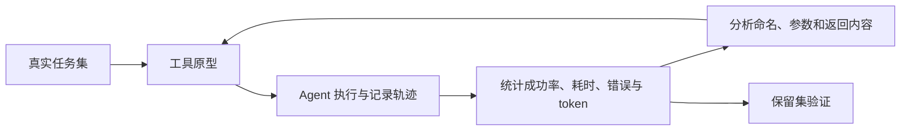

> 本文整理自 Anthropic 使用 Agent 反向优化工具接口的实践。

传统函数连接两个确定性系统，而 Agent 工具连接的是确定性代码与概率模型。即使 schema 合法，模型仍可能选错工具、填错参数、重复调用，或者被庞大的返回结果拖垮。

## 从高价值工作流反推工具

不要把后端每个 API 都暴露成一个工具。相比 `list_users`、`list_events` 和 `create_event`，一个能完成常见业务意图的 `schedule_event` 可能更容易被 Agent 正确使用。

工具应有独立且明确的职责。功能重叠会增加选择难度；统一命名空间则能帮助模型区分服务和资源，例如 `jira_issues_search` 与 `asana_tasks_search`。

## 返回模型真正需要的信息

一次返回全部联系人或十万行日志，会浪费有限上下文。更好的工具提供搜索、分页、字段选择和相关上下文，只把下一步决策需要的数据送回模型。

错误也应具有可操作性。与其返回“invalid request”，不如指出哪个字段不合法、可选值是什么、是否可以重试。Agent 才能在当前运行中自我修正。

## 用评测优化工具，而非只优化 prompt

建立来自真实工作的多步骤任务集，记录准确率、工具调用次数、耗时、token 和参数错误。然后检查完整轨迹，找出模型在哪个接口上迷路。还可以让 Agent 分析失败记录并提出工具说明或 schema 改进，再用独立保留集确认没有过拟合。

原文：[Writing effective tools for agents — with agents](https://www.anthropic.com/engineering/writing-tools-for-agents)，Anthropic，2025-09-11。
