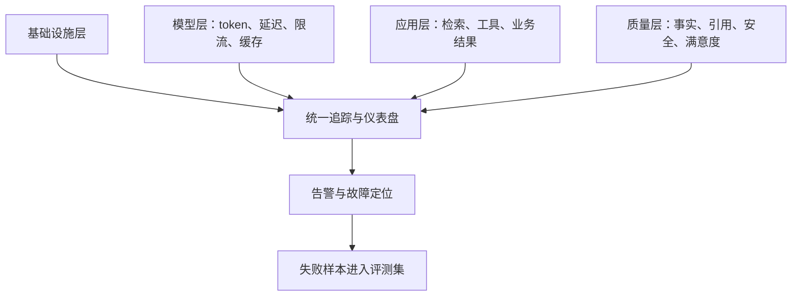

> 本文根据 Google Cloud 的生成式 AI 监控实践整理。

传统服务常用延迟、流量、错误和资源饱和度判断健康状态。生成式 AI 应用还多了一层不确定性：接口可能返回 200，但答案已经偏题、引用错误，或者工具调用没有完成用户目标。

## 四层指标一起看

基础设施层关注 CPU、内存、队列和网络。模型层关注请求延迟、首 token 时间、输入输出 token、限流和错误码。应用层记录检索命中、工具成功率、重试次数和完整任务耗时。

质量层最难，却最接近用户价值。可以通过人工抽样、规则、模型评委和用户反馈估计事实性、相关性、引用完整性和安全性。

## 分布式追踪还原一次回答

一次回答可能经过网关、检索、重排、多个模型和外部工具。应为整个请求保留 trace ID，并记录每个阶段的模型版本、prompt 版本、数据源和耗时。这样质量下降时，才能判断问题来自模型、知识库还是工具。

日志要避免直接保存敏感原文。可以采用脱敏、采样、访问控制和保留期限，同时保存足够的结构化元数据用于排障。

## 从告警回流到评测

线上错误不应只修一次。严重失败应匿名化后加入回归集，验证新版本是否真正修复。生产监控负责发现现实问题，离线评测负责让问题不再复发。

原文：[Monitor your Gen AI applications with Cloud Monitoring](https://cloud.google.com/blog/products/management-tools/monitor-your-gen-ai-applications-with-cloud-monitoring)，Google Cloud。
