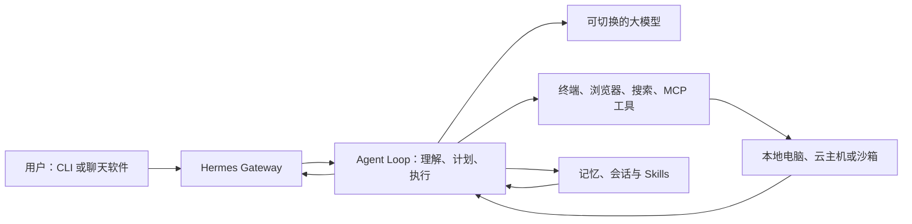
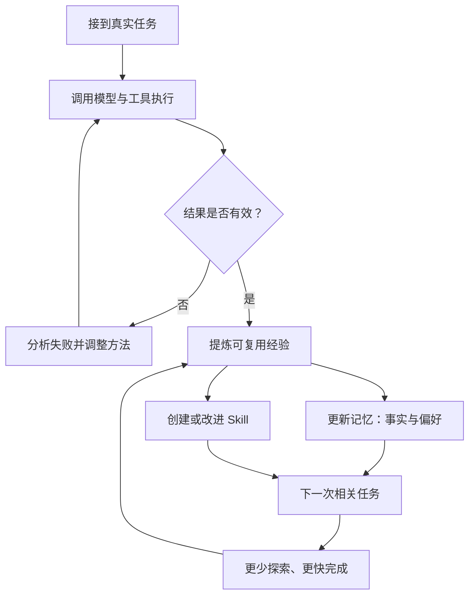

> 本文根据 Nous Research 官方仓库与文档整理。项目仍在快速迭代，版本与数据截至 2026 年 6 月 5 日。

最近 AI 社区频繁讨论的“爱马仕”，通常指 Nous Research 开源的 **Hermes Agent**。它把自己定位为“会与你一起成长的 Agent”，重点不只是完成一次任务，而是把任务中形成的经验、用户偏好和操作方法保存下来，供后续会话继续使用。

截至 2026 年 6 月 5 日，Hermes Agent 的 GitHub 仓库显示约 **18.2 万 Star、3.12 万 Fork**，最新版本为 **v0.15.2**，发布于 2026 年 5 月 29 日。热度数字会持续变化，但足以说明它已经成为近期最受关注的开源 Agent 项目之一。

## 它不是单一模型，而是 Agent 运行系统

Hermes Agent 不绑定某个固定大模型。模型负责理解、规划和生成动作，Agent 运行时负责调用终端、浏览器、搜索、MCP 等工具，并通过 Gateway 把同一个 Agent 接入 CLI、Telegram、Discord、Slack、WhatsApp 和 Signal。

这意味着 Hermes 更像一个可部署的个人 Agent 操作层：你可以把它运行在自己的电脑，也可以放在云服务器上，再通过手机消息远程交代任务。

## 真正吸引人的，是学习闭环

普通聊天机器人每次都像重新认识你。Hermes 尝试把“这次做成了什么”转化为下一次可以复用的能力。

它的内置记忆分为两部分：

1. `MEMORY.md` 保存环境事实、项目约定和已经学到的经验。
2. `USER.md` 保存用户偏好、沟通风格和工作习惯。

官方文档没有让记忆无限增长，而是设置了严格容量限制，迫使 Agent 合并和淘汰低价值内容。历史会话则进入 SQLite，并通过全文搜索按需找回，避免所有旧对话永久占用上下文。

Skills 承担程序性记忆。某个任务完成后，Hermes 可以把有效步骤整理成 Skill；以后遇到类似任务时，只加载 Skill 的描述，再按需读取完整说明和参考文件。

这里的“自我改进”并不是 Agent 自动训练大模型权重，而是不断优化它能够访问的记忆、流程文档和工具使用方法。

## 为什么它会突然走红

第一，它踩中了从“聊天”转向“干活”的需求。用户希望 Agent 能操作终端、处理文件、搜索资料和长期运行，而不是只生成一段回答。

第二，它强调模型自由。Hermes 可以接入 Nous Portal、OpenRouter、OpenAI、Kimi、MiniMax、GLM、Hugging Face 或自建端点。切换模型时，不必重写整个 Agent 系统。

第三，它把个人 Agent 常见的零散能力放进一个项目：多平台消息入口、持久记忆、Skills、MCP、定时任务、工具审批和会话搜索。对想自己部署 Agent 的开发者来说，这比从零拼装更容易上手。

第四，它的 MIT 许可证和快速迭代降低了研究与二次开发门槛。原生 Windows、Linux 和 macOS 支持，也扩大了潜在用户群。

## 它适合做什么

Hermes 更适合需要持续上下文和工具执行的任务，例如：

- 维护长期项目，记住目录结构、运行命令和代码规范。
- 部署在云主机，通过 Telegram 远程执行研究或自动化任务。
- 把反复执行的流程整理成 Skills，例如发布检查、日志分析和资料收集。
- 连接 MCP 服务，把内部系统、数据库或知识库纳入 Agent 工作流。

如果需求只是偶尔问问题，完整的 Agent 平台可能比普通聊天工具更重。需要写文件、运行命令或连接外部系统时，也必须认真配置权限、审批、沙箱和密钥管理。

## 我的判断

Hermes Agent 最值得关注的不是“又一个全能助手”，而是它把 Agent 的长期成长拆成了可观察的工程组件：有限记忆保存关键事实，会话搜索找回历史细节，Skills 沉淀操作流程，Gateway 连接不同入口。

这条路线比宣称 Agent 会神秘地“越用越聪明”更务实。真正决定体验的，仍然是记忆是否准确、Skill 是否可靠、工具边界是否清楚，以及用户是否愿意持续整理这套个人自动化系统。

资料来源：

- [Hermes Agent 官方 GitHub 仓库](https://github.com/NousResearch/hermes-agent)
- [Hermes Agent Persistent Memory 文档](https://hermes-agent.nousresearch.com/docs/user-guide/features/memory)
- [Hermes Agent Skills System 文档](https://hermes-agent.nousresearch.com/docs/user-guide/features/skills)
- [Hermes Agent Releases](https://github.com/NousResearch/hermes-agent/releases)
