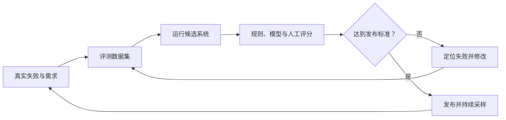

> 本文根据 OpenAI 官方评测指南整理，内容加入了个人工程化理解。

AI 应用最危险的一句话是：“看起来效果不错。”模型输出具有随机性，一次成功演示既不能说明整体质量，也无法保证换模型、改 prompt 或增加工具后没有退化。

## 先定义什么叫成功

评测应该从具体任务开始，而不是从一个通用分数开始。文档问答系统可能关心事实准确率、引用是否匹配和拒答是否合理；客服 Agent 还需要关注工具参数、问题解决率和是否发生越权操作。

一个可执行的评测目标应该能回答：输入是什么、合格输出是什么、如何判断通过、哪些错误最严重。

## 让数据来自真实失败

早期可以用人工编写和合成样本快速起步，但上线后的日志更有价值。用户的模糊表达、错别字、多意图请求、超长上下文和异常工具结果，都会暴露实验环境里看不到的问题。

我更倾向于维护三层数据：

1. 冒烟集：少量核心案例，每次修改后快速运行。
2. 回归集：所有历史严重故障都要成为永久测试。
3. 挑战集：包含边界、对抗和长链路任务，用于版本发布前检查。

## 自动评分也需要被评测

代码结果可以用单元测试或规则直接判断；开放文本则可以使用参考答案、分类器或 LLM 评委。相较于让评委自由写一段评论，成对比较、明确的 pass/fail 和细化评分标准通常更稳定。

但模型评委不是天然正确。它可能偏爱更长的回答，也可能受答案顺序影响。可靠做法是先用人工标注校准评分标准，确认自动评分和人工判断足够一致，再扩大运行规模。

评测不是项目结束前的一次考试，而是开发循环的一部分：记录问题、加入样本、修改系统、运行对比、观察新失败。只有这套循环建立起来，AI 功能才真正具备持续迭代的基础。

原文：[Evaluation best practices](https://developers.openai.com/api/docs/guides/evaluation-best-practices)，OpenAI Developers。
