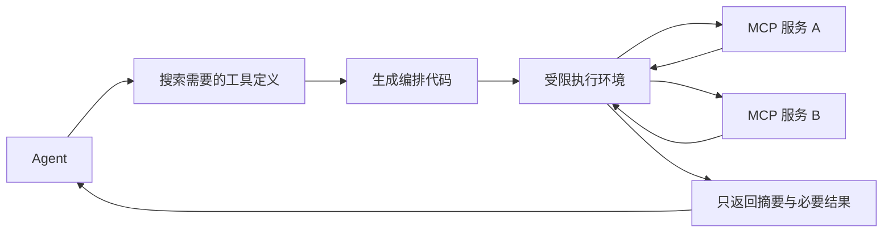

> 本文整理自 Anthropic 关于 MCP 与代码执行的架构分享。

当 Agent 连接几十个 MCP 服务时，把所有工具定义一次性塞入上下文会越来越昂贵。更大的问题是，中间数据常常需要在多个工具之间传递，模型不得不重复阅读和复写大量内容。

## 工具定义按需披露

可以把 MCP 工具映射成文件树或可搜索的代码 API。Agent 先查看服务目录，再读取当前任务需要的少数接口，而不是提前加载所有 schema。这种渐进披露让工具规模增长时，上下文仍可控。

## 中间数据留在执行环境

假设要从表格读取一万行订单，只找出待处理项。直接工具调用会把一万行送进模型；代码执行则可以先过滤、聚合，只打印数量和少量样本。

循环、条件、重试和跨服务数据传递也可以由普通代码完成。模型负责写计划和代码，运行时负责确定性执行，减少每一步都返回模型重新决策的延迟。

## 安全成本不能忽略

运行模型生成的代码需要沙箱、网络和文件权限、资源限制、超时、审计日志以及敏感数据处理。高风险写操作仍应经过授权检查或人工确认。

这套方案适合工具数量大、数据量大、组合逻辑复杂的系统。简单工作流直接调用工具更容易理解和维护，不必为了架构新颖而引入执行环境。

原文：[Code execution with MCP: Building more efficient agents](https://www.anthropic.com/engineering/code-execution-with-mcp)，Anthropic，2025-11-04。
