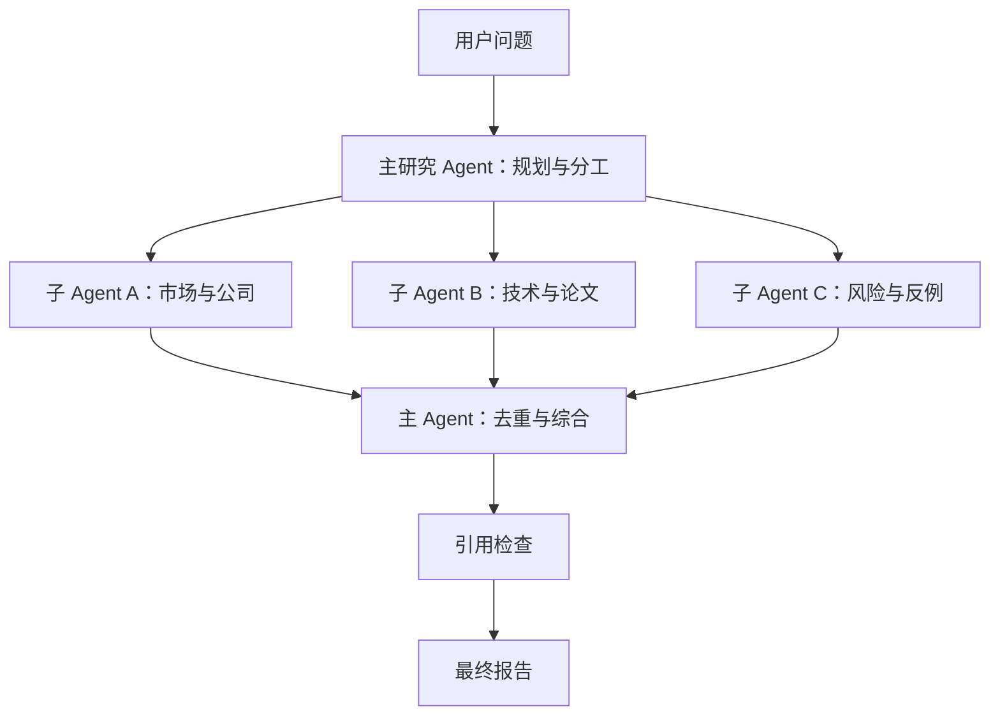

> 本文整理自 Anthropic 多 Agent 研究系统的生产实践。

开放式研究很难预先写死步骤。一次搜索可能带出新的实体、时间线或反例，系统需要持续调整方向。多 Agent 架构的价值，是让多个独立上下文同时探索，再由主 Agent 压缩和合并结果。

## 适合并行的任务

多 Agent 最适合广度优先、方向相对独立、资料量超过单个上下文的任务。比如跨行业调研、竞争格局分析或同时核对多个组织。若子任务高度依赖同一份状态，协调成本可能超过收益。

Anthropic 的内部研究评测显示，多 Agent 系统可以显著提升复杂检索表现，但 token 消耗也远高于普通聊天。工程上不能只看准确率，还要把任务价值、延迟和预算一起纳入路由策略。

## 分工指令必须具体

子 Agent 需要明确目标、边界、期望输出、优先来源和停止条件。模糊地说“调查芯片行业”容易造成重复搜索；更好的指令会指定地区、时间、指标和不需要覆盖的方向。

主 Agent 也需要资源规则：简单事实只用一个 Agent，比较型任务开启少量并行，复杂研究才扩大团队。否则系统会在不值得的问题上过度搜索。

## 生产系统的难点

多 Agent 的错误会级联。系统应保存计划和检查点，允许失败任务重试或恢复；调试时要记录工具选择、搜索路径和交接结果。评测更应关注最终状态、事实准确性、引用质量和工具效率，而不是强制所有运行走同一条路径。

原文：[How we built our multi-agent research system](https://www.anthropic.com/engineering/multi-agent-research-system)，Anthropic，2025-06-13。
