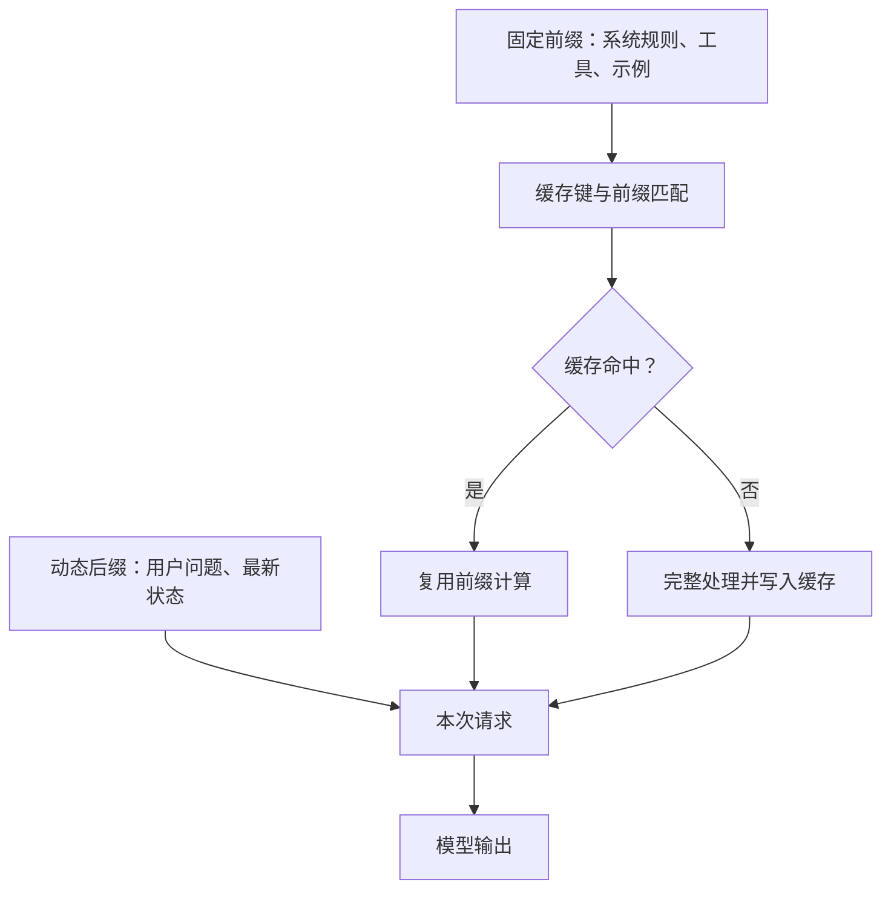

> 本文根据 OpenAI Prompt Caching 官方指南整理。

AI 应用常常重复发送相同的系统规则、工具 schema、示例和知识片段。提示缓存可以复用这些共同前缀的计算结果，降低重复处理带来的延迟和输入成本。

## 提示顺序决定命中率

缓存通常依赖精确的前缀匹配。稳定内容应放在前面，变化内容放在后面。若每次请求都在系统提示顶部插入时间戳、随机 ID 或动态列表，即使大部分内容相同，也可能失去复用机会。

工具定义的顺序也应稳定。只有少量用户相关字段变化时，不要重新排列整个 schema。对多租户系统，还要确保缓存键设计不会跨越不应共享的安全边界。

## 监控而不是猜测

应用应记录输入 token、缓存 token、首 token 延迟、总延迟和不同路由的命中率。命中率低时，先对提示做结构 diff，检查哪些本应稳定的片段在持续变化。

缓存并不会降低输出 token 成本，也不会改善模型质量。它优化的是重复前缀的计算，因此最适合长系统提示、多工具 Agent、重复文档分析和固定 few-shot 示例。

## 与上下文工程一起使用

缓存不是保留冗余内容的理由。先删除无关上下文，再稳定真正必要的前缀，通常能同时获得质量、延迟和成本收益。

原文：[Prompt caching](https://developers.openai.com/api/docs/guides/prompt-caching)，OpenAI Developers。
