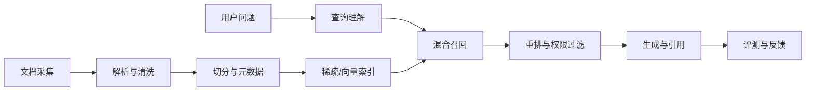

RAG 将外部知识检索结果放入模型上下文，使答案可以基于私有或持续更新的数据。原始论文把检索器与生成器结合起来，但企业落地还需要处理权限、版本、引用和数据质量。

## 两条链路分别治理

离线链路决定知识是否完整、可追踪和及时更新；在线链路决定查询能否找到正确证据并在延迟预算内返回。文档 id、版本、权限和来源 URL 应贯穿两条链路。

排错时先看检索证据，再看生成答案。召回缺失要修索引与查询，证据正确但回答错误才进入 Prompt 或模型层。把两类问题混在一起，会导致无效调参。

原始资料：[Retrieval-Augmented Generation 论文](https://arxiv.org/abs/2005.11401)。
