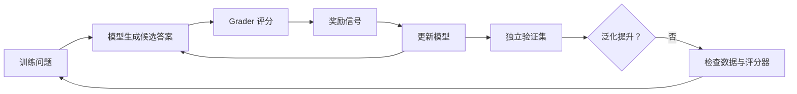

> 本文根据 OpenAI Reinforcement Fine-Tuning 指南整理，重点讨论可迁移的工程方法。

监督微调让模型模仿示例答案，强化微调则让模型生成候选结果，再根据 grader 奖励提升更优行为的概率。它适合结果可以稳定评分、且基础模型已经具备一定能力的任务。

## Grader 决定模型学到什么

如果评分器奖励格式而忽略事实，模型就会学习投机格式；如果规则存在漏洞，训练会放大漏洞。因此开始训练前，应先验证 grader 在正确、部分正确、错误和对抗样本上的区分能力。

代码执行、数学答案、结构化规则或经过校准的模型评委，都可以成为 grader。多维任务更适合拆分事实性、完整性、格式和安全等指标，再谨慎组合。

## 数据要代表未来任务

训练集过窄会让模型记住局部模式。应覆盖真实难度、边界案例和表达变化，并保留从未参与调参的验证集。若基础模型在任务上几乎从不成功，奖励信号也可能过于稀疏，此时先改提示、工具或监督数据更有效。

## 训练不是最后一步

上线前仍需离线评测、红队和成本延迟测试。上线后监控分布漂移，把新失败回流到数据与 grader。模型优化应该服务于一个已经可测量的系统，而不是替代系统设计。

截至 OpenAI 当前文档说明，其 API Reinforcement Fine-Tuning 平台正在逐步停止服务；这里保留的是评分器设计、数据分布和独立验证等通用方法。

原文：[Reinforcement fine-tuning](https://developers.openai.com/api/docs/guides/reinforcement-fine-tuning)，OpenAI Developers。
