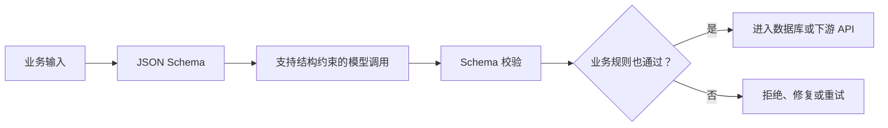

> 本文整理自 OpenAI Structured Outputs 的发布说明与工程实践。

让模型“只返回 JSON”并不等于得到可靠接口。普通 JSON mode 可以保证语法有效，却不保证字段齐全、枚举合法、嵌套层级一致。结构化输出进一步要求模型遵守开发者提供的 JSON Schema。

## Schema 是接口设计，不只是格式

字段名称应该表达稳定含义，枚举要覆盖真实业务状态，必填项应尽量少而明确。过度复杂的 schema 会让生成更困难，也会把临时展示结构固化成长期接口。

可以把模型输出分成两层：第一层是严格结构，例如分类、参数和证据引用；第二层是用户可读文本。这样下游系统可以依赖稳定字段，而展示层仍保留自然语言能力。

## 结构正确不代表事实正确

模型完全可能生成符合 schema 的错误日期、错误金额或不存在的产品编号。因此还需要业务校验：数据库查询、权限检查、数值范围、引用一致性和幂等规则。

拒答也要进入 schema。与其强迫模型在信息不足时编造字段，不如提供 `status`、`reason` 或 `needs_clarification`，让不确定性成为合法状态。

## 适合的使用场景

结构化输出尤其适合工具参数、信息抽取、UI 动态生成、工作流路由和模型评委。它把自然语言系统与确定性软件之间的边界变得更清楚，也让单元测试和回归评测更容易编写。

原文：[Introducing Structured Outputs in the API](https://openai.com/index/introducing-structured-outputs-in-the-api/)，OpenAI，2024-08-06。
